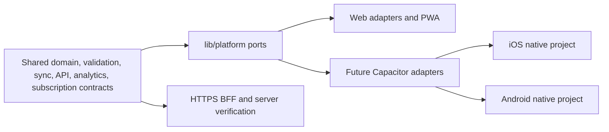

# Féria Capacitor iOS／Android Execution Plan v2

Date: 2026-08-16

Status: current engineering roadmap; Gate 2 complete, native packaging still requires slice review and catalog dependency

## 1. Which Document Controls What

Use the following order when documents appear to disagree:

1. `AGENTS.md` and `docs/CROSS_PLATFORM_VIBE_CODING_GUARDRAILS.md` define authorization and architecture boundaries.
2. `docs/LAUNCH_EXECUTION_TASKS_2026_08_09.json`, `docs/WEB_LAUNCH_GATES_2026_08_01.json`, and `docs/subscription/NATIVE_SUBSCRIPTION_LAUNCH_GATES_2026_08_06.json` are the machine-readable completion truth.
3. `docs/LAUNCH_EXECUTION_MASTER_PLAN_2026_08_09.md` controls overall release order and task dependencies.
4. `docs/MANUAL_LAUNCH_OPERATIONS_GUIDE_2026_08_09.md` and its generated Checklist control the current human execution queue.
5. `docs/IOS_CAPACITOR_PROGRESS.md` retains detailed Phase 1／2 evidence.
6. This document controls the current iOS／Android engineering roadmap.
7. `docs/IOS_CAPACITOR_EXECUTION_PLAN_2026_07_16.md` is a historical v1 architecture plan only.

This plan does not override a closed Gate or turn a local mock, test, draft, or document into release evidence.

## 2. Current Position

| Area | Current status | What it means |
| --- | --- | --- |
| Native direction | Complete | iOS paid launch, then Android paid launch; Web recurring checkout remains deferred |
| Phase 1 packaging feasibility | Complete | The reviewed mobile artifact and HTTPS API boundary are viable |
| Phase 2 API boundary implementation | Substantially complete | BFF, auth, CORS, role, upload/read, lease/idempotency, retry, and compensation logic have verified evidence |
| Capacitor Gate 2 | Complete | Both deployed R2 controlled-failure probes, compensation, safe recovery, and commit-bound smoke passed on 2026-08-24 |
| Account-bound entitlement core | Complete locally | Store-neutral contracts and deterministic tests exist; no production writer authority |
| Platform IAP port | Complete locally | Unavailable Web and fake test adapters exist; no native store SDK adapter |
| Store verification | Contract complete only | Provider runtime, notifications, routes, and writes remain pending approval |
| Apple／Google accounts and catalog | Pending manual | Agreements, tax/banking/payout, app records, testers, devices, prices, offers, and console mappings require protected-console work |
| Phase 3 native bootstrap | Blocked | No Capacitor packages, `ios/`, `android/`, signing, or native adapter work until the implementation slice is reviewed and `STORE-CATALOG-CONFIG` dependencies are resolved |
| Store compliance, sandbox, canary | Blocked by dependencies | Requires final binaries, policy approvals, server verification, entitlement writer, and real-device evidence |

Overall status is `not_ready`. A passing local mobile build does not make the application App Store or Google Play ready.

## 3. Required Architecture

- Shared business logic must not import `@capacitor/*`, StoreKit, or Google Play Billing.
- Camera, filesystem, share, network, lifecycle, secure storage, external links, deep links, and IAP remain platform capabilities behind `lib/platform`.
- The server is authoritative for verified purchases, account-bound entitlements, Founder eligibility, refunds, revocations, grace／hold, and cross-platform restore.
- IndexedDB remains cache／offline temporary state. Recovery remains cloud-rebuild-first and must preserve pending local writes.
- Native must call the reviewed HTTPS API origin; it must not bypass the BFF to reach privileged Supabase or R2 operations.
- Web service-worker behavior must be suppressed by an explicit native build/runtime boundary, not by changing shared domain behavior.

## 4. Execution Gates And Owners

| Order | Slice | Owner mode | Entry condition | Exit evidence |
| --- | --- | --- | --- | --- |
| 0 | AI local baseline and canonical status render | AI | Current checkout available | Checks run, expected blocked states recorded, Checklist regenerated |
| 1 | Commercial, deletion, legal, support policy | Human + AI | Decision owners available | Dated approvals; AI validates completeness without inventing decisions |
| 2 | Apple／Google external readiness | Human + AI | Protected accounts available | Status-only handoff updated with sanitized evidence |
| 3 | SRA-000 live read-only inventory | Human + AI | Authorized read-only session | Complete canonical sections and masked report |
| 4 | Gate 2 R2 controlled failures | Human + AI reviewer | Maintenance window, exact scope, recovery owner | Both probes, physical cleanup, safe redeploy, retry, zero duplicates |
| 5 | Phase 3 Capacitor bootstrap | AI + human reviewer | Gate 2 complete and implementation slice approved | Reviewed dependency lock, configs, `ios/`／`android/`, reproducible local builds |
| 6 | Device and platform adapters | AI + device operator | Phase 3 accepted | Web adapters unchanged; native camera/files/network/lifecycle/link/storage behaviors pass |
| 7 | Native subscription runtime | AI + protected-console owner | Catalog approved; verifier/writer slices approved | Apple／Google adapters, server verification, notifications, idempotent writer, observability |
| 8 | Store compliance and sandbox | Human + AI | Signed final-like binaries | Privacy/data forms, listings, screenshots, complete lifecycle and cross-platform restore |
| 9 | TestFlight／Play canaries | Human + AI | All native gates complete | Bounded cohort, rollback, incident monitoring, dated go／no-go |

Slices 0 through 4 are complete or available as their gates permit. Slice 5 remains
blocked by implementation review and `STORE-CATALOG-CONFIG`; later slices remain blocked
by their own dependencies even if an engineer can technically run the commands.

## 5. Immediate Work Before Capacitor Installation

### 5.1 AI can complete now

- Keep the shared core platform-neutral and extend deterministic contract tests.
- Run the canonical launch, native-readiness, mobile-build, smoke, and Checklist checks.
- Validate status-only JSON, store metadata drafts, catalog schemas, and listing asset manifests without accessing protected accounts.
- Prepare bounded implementation diffs and test plans for later review.
- Validate sanitized human evidence and update canonical status sources only when their completion rules are satisfied.

### 5.2 Human action is unavoidable

- Approve prices, trials, grace／hold, Founder, deletion, retention, legal, refund, cancellation, and support policy.
- Complete Apple／Google enrollment, agreements, identity, tax, banking／payout, app records, testers, and device preparation.
- Execute the authorized Supabase read-only inventory.
- Review the completed, sanitized Gate 2 evidence if release governance requires a second reviewer.
- Operate macOS/Xcode, physical iPhone, Android Studio, physical Android, signing identities, and protected store consoles.

### 5.3 Shared handoff rule

The human performs the protected or physical action and returns only a sanitized status packet. AI then validates the packet, updates the canonical JSON/evidence pointer, regenerates the Checklist, and runs drift checks. No credential, tax/bank document, tester identity, complete project reference, object key, token, or raw customer data enters Git.

## 6. Phase 3 Bootstrap Design — Not Yet Authorized

When Gate 2 and the implementation review are complete:

1. Recheck the exact supported Capacitor release and its Node, Xcode, Android Studio, SDK, and OS requirements on the execution date.
2. Review and lock only the minimum packages: Capacitor core/CLI, iOS, Android, and separately approved capability plugins.
3. Define stable application identifiers, display names, deep-link schemes, API origin, build target, and Web service-worker suppression.
4. Generate both `ios/` and `android/` from the same reviewed mobile artifact.
5. Keep generated native projects reviewable; do not hide signing, permission, URL scheme, privacy manifest, or Gradle changes in bulk regeneration.
6. Prove a clean Web build, mobile artifact verification, iOS simulator/device build, and Android emulator/device build before adding store SDK adapters.

The current Capacitor v8 documentation lists Node 22+, Xcode 26+, Android Studio 2025.2.1+, Android SDK API 24+, and iOS 15+ as baseline requirements. These are planning inputs, not a frozen dependency decision; verify the exact minor and platform support again before installation.

## 7. Adapter And Native Runtime Acceptance

For each capability:

1. Define or reuse a shared port and a Web adapter.
2. Add a future Capacitor adapter without changing domain rules.
3. Make unavailable／denied／cancelled states explicit and recoverable.
4. Preserve fail-closed roles and keep pending writes when delivery is uncertain.
5. Add deterministic unit/contract coverage and real-device evidence where browser simulation is insufficient.

Required native evidence includes camera and gallery permission denial/recovery, large image handling, file share/cancel, offline/reconnect, background/resume, safe area, keyboard, deep links, auth restore, account switching with pending writes, owner/manager/staff permissions, and accessibility.

## 8. Subscription And Store Release Acceptance

- Apple and Google product identifiers map to the same server-owned plan and feature contracts.
- The client never grants entitlement from an unverified store response.
- Verification, notifications, retries, duplicates, out-of-order events, refund, revoke, grace, account hold, expiry, upgrade, downgrade, and restore are idempotent and observable.
- Cross-platform access is account-bound and does not assume the current device store account is the application account.
- Store disclosures match the final binary, SDK list, data flows, deletion behavior, and support URLs.
- Screenshots are captured from final-like builds at required device sizes and roles; draft Web screenshots do not count.
- TestFlight and Play tracks use bounded cohorts, monitored rollback conditions, and no Production fault-injection residue.

## 9. Definition Of Done

The Capacitor launch is done only when all canonical native gates are `complete`, both native projects build reproducibly, the full shared test/build/mobile manifest passes, Apple and Google sandbox lifecycle and cross-platform restore evidence pass, final compliance/assets match the binaries, physical-device matrices pass, canaries remain within thresholds, and the dated release owner records `GO`.

## 10. Current Official References

- Capacitor v8: https://capacitorjs.com/docs
- Environment setup: https://capacitorjs.com/docs/getting-started/environment-setup
- iOS: https://capacitorjs.com/docs/ios
- Android: https://capacitorjs.com/docs/android
