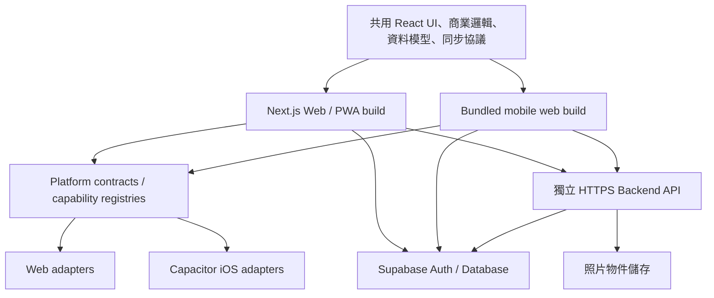

# Feria iOS／Capacitor 完整執行計畫

- 文件日期：2026-07-16
- 文件狀態：`PLANNED — 尚未開始執行`
- 適用專案：Feria Next.js／PWA
- 主要目標：以同一套 React、商業邏輯、資料模型及同步協議，同時維護 Web/PWA 與 iOS App
- 目前開發環境：Windows
- 原生驗證環境：macOS、Xcode、iPhone

## 1. 文件目的

本文件定義 Feria 從現有 Next.js PWA 演進為可上架 App Store 的 Capacitor iOS App 所需的完整工作、執行順序、環境限制、階段 Gate、驗收標準、風險與交付物。

本文件目前只做規劃，不授權或代表下列動作已執行：

- 安裝 Capacitor 套件
- 建立 `ios/` Xcode project
- 修改 production API 或部署設定
- 建立 Apple Developer App ID
- 建立憑證、Provisioning Profile 或 TestFlight build
- 送出 App Store 審核

## 2. 最終目標架構



### 2.1 架構原則

1. Web 與 iOS 不建立兩套商業邏輯。
2. 原生差異只能存在於 `lib/platform/capacitor/` 或 iOS native project。
3. React 元件與共用 services 不可直接匯入 `@capacitor/*`。
4. 正式 iOS build 使用打包於 App 內的前端資產。
5. production 不使用 Capacitor `server.url` 載入完整遠端網站。
6. Next.js API routes 必須轉為 mobile build 可存取的 HTTPS API boundary。
7. Supabase schema、Dexie schema、事件模型與同步協議維持單一來源。
8. 尚未同步的銷售、照片與 pending operations 不可因登出、升級或背景切換而遺失。
9. 同一個 commit 應能分別產生 Web build 與 mobile build。
10. Web 發布與 App Store 發布可以採不同節奏，但必須保持資料協議相容。

## 3. 已完成的前置平台抽象

截至本文件建立時，專案已開始建立以下平台邊界：

- CameraPort
- FilePort
- NetworkPort
- LifecyclePort
- SecureStoragePort
- ClipboardPort
- SharePort
- ExternalLinkPort
- DeepLinkPort
- Web implementations
- capability registries
- Supabase async auth storage bridge

這些內容仍需與本計畫後續的 Capacitor implementations、mobile build 及實機測試整合，不能視為 iOS 功能已完成。

## 4. 環境能力與限制

### 4.1 Windows 可完成

- Capacitor core、CLI 與 JavaScript plugin packages 安裝
- `capacitor.config.ts`
- mobile bundled build
- Capacitor TypeScript adapters
- native bootstrap
- plugin mocks 與 contract tests
- Camera 回傳值轉換與共用壓縮流程
- File／Share／Network／Lifecycle adapters
- Deep Link URL parser 與 routing guards
- Supabase Secure Storage bridge
- API base URL 分離
- CORS、auth token 與 API contract 開發
- Web/PWA 回歸
- mobile build 靜態資產驗證
- macOS CI workflow 定義

### 4.2 macOS／Xcode 必須完成

- 建立及編譯 iOS project
- `npx cap add ios`
- `npx cap sync ios` 原生 dependency resolution
- Xcode simulator
- Swift／Swift Package Manager 編譯
- Bundle ID、Signing、Entitlements
- `Info.plist` 權限
- Associated Domains
- Privacy Manifest
- Keychain plugin 原生驗證
- TestFlight archive 與上傳

### 4.3 實體 iPhone 必須完成

- Camera／Photo Library 實際權限
- HEIC／JPEG 與圖片方向
- Share Sheet／Files App
- Keychain 重開與刪除重裝行為
- 前景、背景與強制終止
- Wi-Fi／行動網路切換
- Universal Link 冷啟動與熱啟動
- App 升級後 IndexedDB／Dexie 資料保留
- TestFlight 真實安裝流程

Capacitor 8 官方環境需求參考：

- <https://capacitorjs.com/docs/getting-started/environment-setup>
- <https://capacitorjs.com/docs/ios>

## 5. Phase 0：產品與發布識別決策

- 預估：1～2 個工作天
- 執行環境：Windows
- 狀態：`NOT STARTED`

### 5.1 工作項目

- [ ] 確認 App 正式名稱
- [ ] 確認 Bundle ID，例如 `com.company.feria`
- [ ] 確認 Apple Developer Program 使用個人或法人帳號
- [ ] 確認正式 Web domain
- [ ] 確認 staging 與 production API domains
- [ ] 確認 Universal Link domain
- [ ] 確認 staging／production Supabase projects
- [ ] 確認 macOS 使用方式與可使用時程
- [ ] 準備至少一台實體 iPhone
- [ ] 確認最低支援 iOS 版本
- [ ] 決定 Keychain 實作策略
- [ ] 定義 dev／staging／production build channels

### 5.2 交付物

- App identity 表
- domains 與 environments 表
- Apple 帳號責任人
- Mac／iPhone 測試資源表
- Keychain 技術決策紀錄

### Gate 0

Bundle ID、正式網域、API 網域與 Apple 開發者身份完成確認後，才允許建立 native config。

## 6. Phase 1：Mobile packaging feasibility spike

- 預估：3～5 個工作天
- 執行環境：Windows
- 優先級：最高
- 狀態：`NOT STARTED`

### 6.1 目的

證明專案能產生不依賴 Next.js server、可由 Capacitor 打包的前端資產。此 Gate 未通過前，不應投入大量 iOS plugin 工作。

### 6.2 盤點項目

- [ ] `app/api` route handlers
- [ ] `/markets/[id]`、`/products/[id]` 等動態 routes
- [ ] Server Components
- [ ] Node-only dependencies
- [ ] `cookies()`、`headers()` 或 server actions
- [ ] Next Image／font／asset path
- [ ] React PDF browser build
- [ ] Service Worker
- [ ] Supabase browser client
- [ ] Dexie／IndexedDB
- [ ] Next Link／Router 直接依賴
- [ ] 頁面重新整理與 fallback routing

### 6.3 候選方案 A：Next.js 靜態 mobile build

優先嘗試：

- 使用 client-side data loading
- 將 API base URL 外部化
- 評估 `output: 'export'`
- 將不能預先列舉的動態 route 改為 query route，例如 `/market?id=...`
- Web route 可保留 redirect 或共用 screen component
- 確認所有 mobile routes 可由打包資產直接開啟

### 6.4 候選方案 B：Vite mobile shell

若 Next 靜態輸出造成大量特殊條件，建立：

```text
mobile/
├─ index.html
├─ main.tsx
├─ routes.tsx
└─ native-bootstrap.ts
```

Vite shell 只負責：

- mobile root
- routing
- providers
- native bootstrap
- navigation composition

下列內容必須繼續共用：

- `components/`
- `hooks/`
- `lib/`
- `types/`
- analytics engines
- sync services
- permissions
- forms
- Dexie repositories

### 6.5 決策標準

選擇 Next static build，除非：

- 需要大量複製 screen
- 重要頁面無法移除 Next server dependency
- 動態 route 無法合理轉為 client routing
- 必須使用 `server.url` 才能運作
- mobile build 的條件判斷開始散佈到商業邏輯

### 6.6 驗收

- [ ] Windows 能產生 mobile static output
- [ ] 可由本機靜態 server 開啟
- [ ] 登入 UI 可啟動
- [ ] 主要 navigation 正常
- [ ] Dexie 可建立及讀寫
- [ ] Supabase 可連線
- [ ] 市集與商品頁能 client-side loading
- [ ] 不需要 Next runtime
- [ ] production mobile build 不設定遠端 `server.url`

### Gate 1

必須取得可離線開啟的 bundled mobile build，才能進入正式 Capacitor plugin implementation。

## 7. Phase 2：Backend API boundary 分離

- 預估：3～6 個工作天
- 執行環境：Windows
- 狀態：`NOT STARTED`

### 7.1 工作項目

- [ ] 建立統一 `lib/api/client.ts`
- [ ] 新增 `NEXT_PUBLIC_API_BASE_URL` 或 mobile 對應設定
- [ ] 將照片上傳移除相對 `/api` 假設
- [ ] 將照片讀取移除相對 `/api` 假設
- [ ] 統一 timeout
- [ ] 統一 error contract
- [ ] 定義 retry policy
- [ ] 附加 Supabase Bearer token
- [ ] server 端驗證 token 與 user identity
- [ ] server 端重新檢查 owner／staff 權限
- [ ] 設定精確 CORS allowlist
- [ ] 加入 Web production origin
- [ ] 加入 iOS Capacitor origin，例如 `capacitor://localhost`
- [ ] 建立 health check
- [ ] 建立 staging／production endpoints

### 7.2 安全要求

- 不信任前端傳入的 owner ID 或 staff ID
- 不將 R2／server secrets 包入前端
- server 重新驗證 MIME、file size 與資料權限
- invitation token 與 auth token 不得寫入 log
- authenticated CORS 不使用不受限 wildcard
- API errors 不回傳內部 stack 或秘密設定

### 7.3 驗收

- [ ] Web 與 mobile build 使用同一 API client
- [ ] 照片讀取與上傳通過
- [ ] token 無效時 fail closed
- [ ] staff／owner 權限未被放寬
- [ ] mobile build 不依賴 Next route runtime

### Gate 2

mobile build 能透過明確 HTTPS API 完成照片讀取與上傳。

## 8. Phase 3：Capacitor 基礎與 Native Bootstrap

- 預估：2～4 個工作天
- 執行環境：Windows 可完成 TypeScript 部分
- 狀態：`NOT STARTED`

### 8.1 套件規劃

所有 Capacitor packages 必須鎖定相同 major 及相容版本：

- `@capacitor/core`
- `@capacitor/cli`
- `@capacitor/camera`
- `@capacitor/filesystem`
- `@capacitor/share`
- `@capacitor/network`
- `@capacitor/app`
- `@capacitor/clipboard`
- `@capacitor/browser`
- `@capacitor/ios`（Mac 階段產生 native project）

### 8.2 目錄

```text
lib/platform/capacitor/
├─ camera.ts
├─ files.ts
├─ network.ts
├─ lifecycle.ts
├─ secure-storage.ts
├─ clipboard.ts
├─ share.ts
├─ external-links.ts
├─ deep-links.ts
├─ platform.ts
└─ bootstrap.ts
```

### 8.3 Bootstrap 順序

Native platform 必須在下列工作前安裝：

1. Supabase session restore
2. AuthProvider initialization
3. SyncProvider initialization
4. initial deep link consumption
5. device capability calls

### 8.4 Capacitor config 原則

```ts
const config = {
  appId: 'com.company.feria',
  appName: 'Feria',
  webDir: 'mobile-dist',
};
```

正式版禁止以遠端 production site 作為 `server.url`；該設定只可用於本機 live reload。

### 8.5 驗收

- [ ] Web build 不執行 native-only imports
- [ ] mobile build 能載入 Capacitor adapters
- [ ] bootstrap 早於 Supabase session restore
- [ ] 所有 adapters 可注入 fake plugin
- [ ] platform contract tests 通過

### Gate 3

Windows 可完整產生 mobile build，且 Web/PWA 行為無回歸。

## 9. Phase 4：Capacitor adapters

- 預估：7～12 個工作天
- Windows：程式、mock、contract tests
- iPhone：最終驗收
- 狀態：`NOT STARTED`

### 9.1 Camera

- [ ] `Camera.getPhoto`
- [ ] camera／library source mapping
- [ ] native URI／base64 轉 Blob／File
- [ ] permission denied mapping
- [ ] cancelled mapping
- [ ] 保留共用壓縮 policy
- [ ] 保留 Dexie pending payload storage
- [ ] 不複製照片 upload business flow

實機驗收：

- [ ] camera
- [ ] photo library
- [ ] cancellation
- [ ] permission denial
- [ ] HEIC／JPEG
- [ ] orientation
- [ ] large image memory
- [ ] offline persistence

### 9.2 Filesystem／Share

- [ ] CSV 儲存／分享
- [ ] JSON backup 儲存／分享
- [ ] PDF temporary file
- [ ] native Share Sheet
- [ ] temporary file cleanup
- [ ] filename／MIME mapping
- [ ] large PDF error handling

### 9.3 Network

- [ ] `Network.getStatus`
- [ ] `networkStatusChange`
- [ ] 對映既有 `NetworkStatus`
- [ ] debounce network flapping
- [ ] reconnect 只觸發受控同步

### 9.4 Lifecycle

- [ ] `App.getState`
- [ ] `appStateChange`
- [ ] background 不啟動新同步
- [ ] foreground 驗證 session
- [ ] foreground 檢查 pending writes
- [ ] foreground 檢查照片 queue
- [ ] foreground 重新讀 network status

不得假設 iOS background 期間 JavaScript 會持續執行。

### 9.5 Clipboard／Share／External Links

- [ ] native Clipboard
- [ ] native Share
- [ ] Browser plugin 開啟 HTTPS
- [ ] URL scheme allowlist
- [ ] 拒絕 `javascript:` 與未知 schemes

### 9.6 Deep Link

- [ ] Universal Link
- [ ] custom scheme fallback
- [ ] initial URL queue
- [ ] router ready 前暫存
- [ ] duplicate URL 去重
- [ ] malformed URL 拒絕
- [ ] token log redaction
- [ ] invitation route
- [ ] auth callback route
- [ ] route allowlist

建議允許：

```text
/join
/auth/callback
/markets
/products
/reports
```

### 9.7 Secure Storage

Supabase session token 不使用 Preferences。應使用小型自製 Keychain plugin，或通過相容性與安全審查的 plugin。

- [ ] get／set／remove
- [ ] session restore
- [ ] refresh token
- [ ] sign-out cleanup
- [ ] expired session
- [ ] account switch
- [ ] app upgrade
- [ ] uninstall／reinstall policy
- [ ] previous-install session reconciliation

### Gate 4

所有 adapter contract tests 通過，尚未實機驗證的能力標記為 `native-verification-pending`。

## 10. Phase 5：離線與資料安全

- 預估：4～7 個工作天
- 狀態：`NOT STARTED`

### 10.1 工作項目

- [ ] native runtime 停用不必要的 Service Worker
- [ ] Dexie schema migration
- [ ] IndexedDB data retention
- [ ] App version upgrade
- [ ] pending operations restart recovery
- [ ] photo payload storage quota
- [ ] low-storage failure handling
- [ ] forced termination recovery
- [ ] account deletion storage cleanup
- [ ] temporary file cleanup
- [ ] 未同步資料 destructive action guard

### 10.2 主要資料安全情境

```text
離線成交
→ 拍照
→ App 被終止
→ 重開 App
→ 恢復 pending queue
→ 恢復網路
→ 只上傳一次
```

### Gate 5

App background、termination、upgrade 與 reconnect 不得造成銷售或照片遺失、重複寫入或跨帳號污染。

## 11. Phase 6：macOS／Xcode 原生整合

- 預估：3～6 個工作天
- 執行環境：macOS
- 狀態：`NOT STARTED`

### 11.1 工作項目

- [ ] 安裝 Xcode 26+ 與 Command Line Tools
- [ ] 確認 Node／Capacitor versions
- [ ] 安裝 `@capacitor/ios`
- [ ] `npx cap add ios`
- [ ] `npx cap sync ios`
- [ ] 設定 Bundle ID
- [ ] 設定 Signing Team
- [ ] 設定最低 iOS 版本
- [ ] 設定 Camera permission text
- [ ] 設定 Photo Library permission text
- [ ] 設定 URL scheme
- [ ] 設定 Associated Domains
- [ ] 部署 AASA
- [ ] 建立 Privacy Manifest
- [ ] simulator build
- [ ] physical-device build
- [ ] Swift／SPM plugin compilation
- [ ] 驗證 `ios/` 可由 clean checkout 重建

### Gate 6

`xcodebuild`、simulator 與實體裝置皆成功，無 signing、plugin 或 privacy manifest 阻塞。

## 12. Phase 7：實機測試矩陣

- 預估：5～10 個工作天
- 狀態：`NOT STARTED`

| 類別 | 必測情境 |
|---|---|
| Auth | 登入、重開、refresh、過期、登出、帳號切換 |
| Offline | 飛航模式、斷網成交、恢復同步 |
| Lifecycle | foreground、background、forced termination |
| Camera | 拍照、相簿、拒絕權限、取消、HEIC |
| Storage | App 更新、空間不足、大量照片 |
| Sync | duplicate event、permission downgrade、identity switch |
| Files | CSV、JSON、PDF、Share Sheet |
| Deep Link | 未安裝、已安裝、冷啟動、熱啟動 |
| Invitation | Universal Link、登入後接受、過期 token |
| Recovery | pending write 阻擋登出、清除與修復 |
| UI | safe area、keyboard、rotation、text size |
| Network | Wi-Fi／cellular／offline 切換 |

裝置範圍：

- [ ] 一台較舊 iPhone
- [ ] 一台目前主流 iPhone
- [ ] 最低支援 iOS
- [ ] 最新穩定 iOS

### Gate 7

所有 P0 資料安全、登入與同步測試通過，沒有資料遺失、重複上傳或跨帳號殘留。

## 13. Phase 8：App Store 合規

- 預估：4～7 個工作天
- 狀態：`NOT STARTED`

### 13.1 必須完成

- [ ] App 內完整帳號刪除
- [ ] 刪除 Supabase Auth account
- [ ] 刪除或依政策保存關聯雲端資料
- [ ] 清除 Keychain／IndexedDB／temporary files
- [ ] 移除或完成 placeholder 訂閱功能
- [ ] 評估 StoreKit／In-App Purchase
- [ ] App 內隱私政策
- [ ] App Privacy disclosure
- [ ] Camera／Photo Library 使用目的
- [ ] support URL
- [ ] demo review account
- [ ] App icon
- [ ] App Store screenshots
- [ ] Review Notes
- [ ] 隱藏 debug routes／test workbench
- [ ] production build 無 staging secrets

### 13.2 App-like 功能說明

Review Notes 應說明：

- 離線銷售記錄
- 本機 pending queue
- 相機照片憑證
- reconnect sync
- 原生 Share／Filesystem
- deep links
- owner／staff permissions

### Gate 8

App 內沒有 placeholder 功能；帳號可完整刪除；審核帳號可操作完整核心流程。

## 14. Phase 9：CI/CD 與雙平台維護

- 預估：3～5 個工作天
- 狀態：`NOT STARTED`

### 14.1 一般 PR checks

- [ ] ESLint
- [ ] platform contract tests
- [ ] unit tests
- [ ] staff typecheck
- [ ] Web build
- [ ] mobile bundled build
- [ ] API contract tests

### 14.2 macOS CI

- [ ] `npm ci`
- [ ] mobile build
- [ ] `npx cap sync ios`
- [ ] `xcodebuild` simulator
- [ ] signing-free PR build
- [ ] protected TestFlight workflow

### 14.3 發布模型

```text
同一個 commit
├─ Web build → Web deploy
└─ Mobile build → Capacitor sync → TestFlight → App Store
```

不需要每次 Web 發布都送 App Store：

| 變更 | 是否通常需要 App 更新 |
|---|---|
| Backend 修正 | 否 |
| 雲端資料與內容 | 否 |
| Bundled React UI／JS | 是 |
| Native plugin／permissions | 是 |
| iOS config／entitlements | 是 |
| Dexie schema | 視向後相容策略而定 |

## 15. 時程估算

| 階段 | 預估 |
|---|---:|
| Phase 0～1 決策與 packaging spike | 1 週 |
| Phase 2 API 分離 | 1 週 |
| Phase 3 mobile build 與 bootstrap | 0.5～1 週 |
| Phase 4 Capacitor adapters | 1.5～2.5 週 |
| Phase 5 離線與資料安全 | 1～1.5 週 |
| Phase 6 Mac／Xcode | 1 週 |
| Phase 7 實機 QA | 1～2 週 |
| Phase 8～9 合規與發布 | 1～1.5 週 |

總計約 7～10 週，不含 Apple 審核等待、重大既有缺陷或外部帳號申請時間。

## 16. 主要風險

| 風險 | 影響 | 緩解方式 |
|---|---|---|
| Next.js 無法合理靜態輸出 | 無法 bundled mobile build | Phase 1 time-boxed spike，必要時改 Vite shell |
| production 使用 remote `server.url` | 離線、審核與更新風險 | 正式版只使用 bundled assets |
| API route 與前端同網域假設 | iOS 呼叫失敗 | Phase 2 API base URL 與 CORS 分離 |
| IndexedDB 在 WKWebView 行為差異 | 本機資料遺失 | schema migration、upgrade、termination 實機測試 |
| Keychain 刪除重裝仍殘留 | 錯誤恢復舊 session | installation identity 與 session reconciliation |
| HEIC／大圖處理 | crash／memory pressure | 共用壓縮 policy 與實機壓力測試 |
| lifecycle 誤認為可背景持續同步 | pending work 中斷 | foreground recovery，不依賴 background JS |
| Universal Link 設定錯誤 | invitation/auth 無法導回 App | AASA、自動測試、冷熱啟動矩陣 |
| Web／iOS 功能分叉 | 維護成本上升 | platform ports、單一 business logic、contract tests |
| placeholder subscription | App Review rejection | 送審前隱藏或正式完成 StoreKit |
| 缺少完整帳號刪除 | App Review rejection | Phase 8 完成 Auth 與資料刪除流程 |

## 17. 全案 Definition of Done

只有同時符合以下條件，才可視為 iOS 上架工程完成：

- [ ] 同一份商業邏輯供 Web 與 iOS 使用
- [ ] production iOS 使用 bundled assets
- [ ] API 不依賴 mobile 與 Next 同網域
- [ ] 所有 native capability 經 platform ports
- [ ] Windows mobile build 通過
- [ ] macOS Xcode build 通過
- [ ] 實體 iPhone 核心流程通過
- [ ] 離線銷售與照片不遺失、不重複
- [ ] session 可恢復、refresh 並完整清除
- [ ] deep links 冷熱啟動正常
- [ ] App 升級保留 Dexie 資料
- [ ] 帳號可在 App 內完整刪除
- [ ] subscription／payment 符合 Apple 規範
- [ ] App Privacy、權限、Review Notes 完成
- [ ] TestFlight beta 通過
- [ ] App Store submission 完成

## 18. 核准後的第一個執行任務

本計畫獲得核准後，第一個任務應是 Phase 1 的 mobile packaging feasibility spike，而不是直接建立 Camera adapter 或 Xcode project。

執行順序：

1. 建立 packaging blocker inventory。
2. 試作 Next static mobile build。
3. 記錄每個 blocker、修改成本與共用率。
4. 依 Gate 1 標準選擇 Next static build 或 Vite mobile shell。
5. 產出 architecture decision record。
6. Gate 1 通過後才進入 API 分離與 Capacitor 安裝。

## 19. 官方參考

- Capacitor Documentation：<https://capacitorjs.com/docs>
- Environment Setup：<https://capacitorjs.com/docs/getting-started/environment-setup>
- Capacitor iOS：<https://capacitorjs.com/docs/ios>
- App／Lifecycle／Deep Link API：<https://capacitorjs.com/docs/apis/app>
- Deep Links：<https://capacitorjs.com/docs/guides/deep-links>
- Apple App Review Guidelines：<https://developer.apple.com/app-store/review/guidelines/>
- Apple Account Deletion：<https://developer.apple.com/support/offering-account-deletion-in-your-app>
