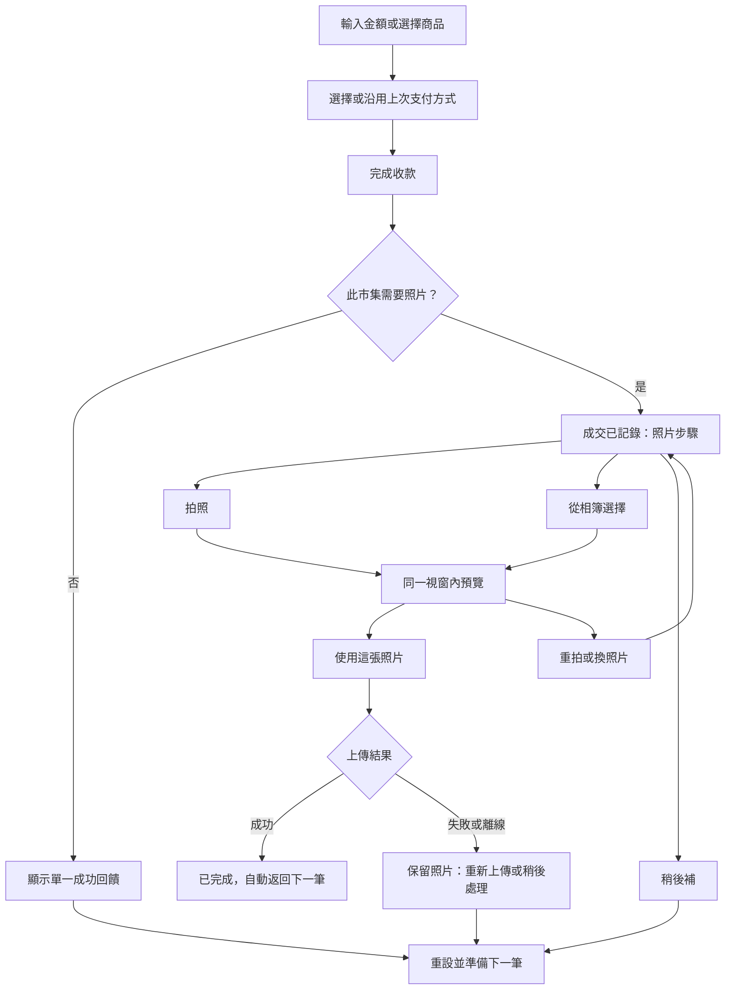

# 成交與照片紀錄 UI/UX 優化計畫

日期：2026-07-15
狀態：已實作，自動化驗證完成；真機相機／相簿 Smoke Test 待人工執行
範圍：營業中的快速收款、商品銷售、成交後照片、待補照片；補登收入只調整與照片流程的銜接

## 0. 實作結果

| 階段 | 結果 | 主要產出 |
| --- | --- | --- |
| Phase 0 | 完成 | 純狀態機、交易摘要、集中支付方式及非法轉換測試 |
| Phase 1 | 完成 | 老闆與員工共用單一成交照片 Dialog；拍照、相簿、預覽、上傳及重試在同一視窗 |
| Phase 2 | 完成 | 待補照片任務清單、交易金額／支付／商品摘要及單一主要行動 |
| Phase 3 | 完成 | 快速收款／商品銷售統一工作台、共用支付選擇、單一成交按鈕及最近支付方式記憶 |
| Phase 4 | 程式加固完成 | Headless UI Dialog、提交鎖、44 px 觸控目標、安全區、權限範圍及上傳失敗恢復 |
| Phase 5 | 自動化完成 | 完整測試、ESLint、TypeScript 與 Next.js production build；真機測試仍需人工執行 |

實作決策與原計畫差異：

- 新工作台直接取代老闆與員工頁面的舊版交易區，既有 runtime／upload production flags 仍維持原保護，不另加只控制畫面的重複旗標。
- 舊的三段照片元件暫時保留一個版本週期作為程式層回退參考，但已不再由正式老闆或員工頁面掛載。
- 營業中的工作台只顯示本場照片規則與待補數量；老闆的規則開關保留在非營業管理區，不再打斷收款流程。
- 未加入操作分析埋點，因此點擊數與完成時間以本節驗收路徑作為基準，尚無正式環境量測資料。

尚待人工完成：

1. iOS Safari 與 Android Chrome 的拍照、相簿、取消及螢幕旋轉。
2. 正式環境實際上傳、模擬 500／離線後重試，以及頁面重整後從待補清單續作。
3. 360 x 640、390 x 844 與平板尺寸的登入後市集頁視覺確認。

## 1. 最終目標

讓老闆或員工在市集現場，以最少判斷、最少畫面切換完成一筆交易，並在需要時自然接續拍照、預覽及上傳。交易必須先安全成立；照片失敗、取消、離線或關閉視窗都不能造成交易或本機照片遺失。

目標體驗：

- 一般成交只出現一個明確的完成結果，不同時疊加動畫、Toast 與 Dialog。
- 需要照片時，從成交完成到照片上傳只使用一個連續視窗，不堆疊多個 Dialog。
- 操作者每個畫面只需要辨識一個主要行動。
- 完成後自動回到可輸入下一筆交易的狀態。
- 稍後補拍是安全退路，不是錯誤，也不需要額外確認。
- 正常操作畫面不出現同步佇列、建立狀態、重試次數或儲存服務等技術詞彙。

## 2. 現況問題

### 2.1 成交入口彼此不一致

目前快速收款、商品銷售、購物車及補登收入各自管理支付、成功提示、清空與關閉行為：

- `QuickInteractionButtons` 先顯示成功動畫及 Toast，再等待照片結果。
- `QuickTransactionGrid` 等待照片結果後再顯示另一個成功 Toast。
- `CartDrawer` 結帳後會清空並關閉抽屜。
- `AddRevenueDialog` 同時包含簡化與完整輸入，語意上又與現場快速收款接近。
- `card` 在不同畫面分別顯示為轉帳、刷卡或信用卡，資料含義與 UI 文案不一致。

結果是同一筆交易在不同入口有不同節奏，使用者無法建立穩定的操作習慣。

### 2.2 成交成功與照片要求互相競爭

目前成交後可能先看到成功動畫或 Toast，再看到「成交已儲存」Dialog，接著開啟系統拍照／相簿，最後再進入預覽 Dialog。成功訊息與下一個必要任務同時爭奪注意力。

另外，照片提示會先重新讀取完整待補清單，再尋找剛成交的項目。這會把非必要的讀取延遲放在成交後的關鍵路徑上，也可能把主要按鈕退化為「開啟待補照片」。

### 2.3 照片流程由多個視窗拼接

現在有成交後提示、待補清單及照片預覽三個獨立 Dialog。從待補清單開啟照片預覽時，會形成前後兩層 Dialog；上傳成功後再回到清單。雖然功能成立，但畫面焦點、返回行為與完成感不連續。

### 2.4 待補照片像診斷工具，不像工作清單

每筆待補項目同時顯示狀態、嚴重程度、系統建議、縮圖、拍攝區、上傳區、重試資訊與錯誤區。一般操作者其實只需要知道：

1. 這是哪一筆交易。
2. 現在要拍照、上傳，還是重試。
3. 照片是否安全保留。

目前資料又只有成交時間，缺少金額、商品及支付方式，現場連續成交時不容易辨認目標交易。

### 2.5 營業畫面的資訊架構打斷交易

「成交照片」設定卡位於快速新增收入與商品銷售之間，將管理設定、待辦入口與交易操作混在同一條主流程。快速新增收入及商品銷售又使用外觀類似設定開關的 Toggle 來控制展開，與使用者熟悉的開關語意不符。

### 2.6 行動裝置與無障礙仍不完整

目前照片 Dialog 有 `aria-modal`，但沒有共用的 Focus Trap、Esc 關閉、關閉後焦點還原及 Body Scroll Lock。商品網格在窄螢幕仍使用五欄，付款與主要行動也不一定固定在拇指容易觸及的位置。

## 3. 建議的目標操作流程

### 3.1 最短正常路徑

常用支付方式應被記住。操作者輸入金額或選完商品後，只需：

1. 按一次「完成收款 NT$ 金額」。
2. 按「拍照」，由系統相機完成拍攝。
3. 在預覽按「使用這張照片」。

保留預覽是既定需求，因此不採用選完照片後自動上傳。可減少的是重複確認、視窗切換及同時出現的回饋，而不是省略必要的照片確認。

### 3.2 單一成交完成視窗

以一個 `SaleCompletionDialog` 承載下列狀態，狀態改變時只替換內容，不開啟第二個 Dialog：

- `saving_sale`：防止重複提交，顯示「正在記錄交易」。
- `photo_required`：顯示成交摘要及「拍照／相簿／稍後補」。
- `processing_photo`：顯示照片正在處理，不跳出額外 Toast。
- `previewing`：照片佔主要視覺，底部只有一個主要行動。
- `uploading`：鎖定離開與重複提交，顯示「正在儲存照片」。
- `upload_failed`：照片留在畫面，主要行動改為「重新上傳」。
- `completed`：顯示完成狀態，短暫停留後自動返回交易工作台。
- `deferred`：確認照片已列入待補後立即返回，不再開另一個清單。

建議文案：

- 標題：「成交完成」
- 摘要：「NT$1,280 · 現金 · 2 件商品」
- 提示：「請拍下本次售出的商品」
- 主要按鈕：「拍照」或「使用這張照片」
- 次要按鈕：「從相簿選擇」、「稍後補」、「重拍／換照片」
- 上傳中：「正在儲存照片」
- 失敗：「照片已保留，現在可重新上傳，或稍後處理」

「拍照」與「從相簿選擇」應使用不同的 File Input 行為，避免目前 `capture=environment` 與「拍攝／選擇」混用所造成的不確定性。

### 3.3 統一交易工作台

將營業中的兩個主要交易方式整合為同一區塊：

- 使用 Segmented Control 切換「快速收款／商品銷售」，不再使用 Toggle 展開。
- 快速收款保留數字鍵盤，但移除與交易任務無關的統計干擾。
- 商品銷售在手機使用 2 至 3 欄商品網格，點擊商品後直接顯示數量 Badge。
- 購物車摘要固定在操作區底部，可展開調整數量，不需要在長頁面中來回捲動。
- 支付方式使用一致的選項列，預設沿用本裝置上一次使用的方式。
- 全部入口共用一個主要按鈕：「完成收款 NT$ 金額」。
- 支付方式定義集中管理；先決定 `card` 代表信用卡或轉帳，再統一所有顯示與歷史資料讀法。

現場交易建議改稱「快速收款」；`AddRevenueDialog` 保留「補登收入」，清楚區分即時成交與歷史補登。

### 3.4 簡化待補照片

待補照片應是可執行的任務清單，每筆只呈現：

- 成交時間。
- 金額、支付方式及商品摘要。
- 縮圖或明確的空白照片位置。
- 一個依狀態決定的主要按鈕。

狀態與主要行動：

| 使用者狀態 | 顯示文字 | 主要行動 |
| --- | --- | --- |
| 尚未選照片 | 尚未拍照 | 拍照 |
| 已有本機照片 | 照片尚未上傳 | 上傳照片 |
| 正在處理 | 正在儲存 | 無，顯示進度 |
| 可重試失敗 | 照片已保留 | 重新上傳 |
| 暫時不能處理 | 稍後再試 | 返回交易 |

系統狀態、重試次數、錯誤碼與診斷建議移出一般 UI。老闆或測試環境如需查看，放在折疊的「處理詳情」，且預設關閉。

從清單點入某筆後，在同一個 Dialog 內切換成拍照／預覽畫面，使用返回按鈕回到清單，不建立第二層 Dialog。

### 3.5 重新安排成交照片設定

- 老闆的「此市集需要成交照片」移入編輯市集或營業設定，不放在交易工作台中央。
- 營業畫面只保留緊湊狀態，例如相機圖示與「本場需拍照」。
- `待補照片 2` 使用有數量 Badge 的入口，只有數量大於零時提高視覺權重。
- 員工不需要看到不能操作的設定卡，只需要知道本場規則與自己的待辦。

### 3.6 補登收入的例外處理

補登收入通常代表過去的交易，不應強制打斷操作者立即開啟相機。建議規則：

- 補登成功後仍依市集規則建立待補紀錄。
- 顯示非阻塞提示：「補登完成，照片已列入待補」。
- 提供「現在補照片」快捷行動，但不自動開啟拍照流程。
- 正常營業中的快速收款與商品銷售才進入即時照片流程。

這可避免「補登收入」與「現場結帳」使用同一個不合情境的完成節奏。

## 4. 執行階段

### Phase 0：行為契約與基準

1. 建立純狀態機，明確定義成交、照片、離線、取消、重試及完成轉換。
2. 集中支付方式的值、圖示及文案，先停止新增不一致顯示。
3. 建立目前流程的基準：完成點擊數、Dialog 數量、返回下一筆所需時間。
4. 使用測試固定不可退讓條件：交易先成立、本機照片不提前刪除、上傳具冪等性。

完成條件：不改現有畫面也能用單元測試驗證全部合法與非法狀態轉換。

### Phase 1：整併成交後照片流程

1. 新增共用成交完成控制器，供老闆與員工頁面使用。
2. 以單一 `SaleCompletionDialog` 取代成交提示與獨立預覽 Dialog 的串接。
3. 移除同一筆交易重複的成功動畫／Toast，只保留單一完成回饋。
4. 將拍照與相簿拆成明確入口。
5. 上傳失敗時保留預覽、顯示重新上傳及稍後處理。
6. 成功後自動關閉、清空該筆輸入，將焦點還給下一筆交易。
7. 讓 runtime 結果直接提供剛建立的待補項目，避免先讀完整清單才開啟照片步驟。

完成條件：正常路徑最多一個應用程式 Dialog；不再同時出現成功 Toast 與照片 Dialog；老闆與員工行為一致。

### Phase 2：將待補清單改為任務清單

1. 以 `saleEventId` 連接本機成交事件，建立含金額、支付方式、商品摘要的 Read Model，不複製另一份交易真相。
2. 每筆只顯示一個符合目前狀態的主要行動。
3. 沒有照片時不顯示「上傳照片」；已有照片時不再顯示兩個獨立操作卡。
4. 隱藏一般操作者不需要的診斷資訊。
5. 清單、拍照、預覽與重試改成同一 Dialog 內的 View State。
6. 移除一般流程中的「重新讀取」依賴，開啟與成功操作後自動刷新；保留錯誤時的重試入口。

完成條件：操作者不需閱讀狀態碼就能判斷下一步；連續成交時能從金額與商品辨認交易。

### Phase 3：建立統一交易工作台

1. 將快速收款與商品銷售改為同一工作台的兩個 Tab。
2. 共用支付選擇、成交按鈕、提交鎖定、成功回饋與照片完成流程。
3. 記住最近使用的支付方式，但允許單次切換。
4. 商品網格與購物車改為手機優先，保持結帳總額及主要按鈕可見。
5. 移動成交照片設定，縮小營業畫面上的照片規則與待補入口。
6. 補登收入維持獨立入口並採用非阻塞照片提示。

完成條件：三種成交入口不再各自實作付款與完成邏輯；同一支付方式在所有畫面有同一含義與文案。

### Phase 4：可用性、無障礙與韌性加固

1. 使用專案既有的 Headless UI Dialog 建立 Focus Trap、Esc、焦點還原與 Scroll Lock。
2. 支援手機安全區、360 x 640 小螢幕、橫向畫面及桌面畫面。
3. 所有主要觸控目標至少 44 x 44 px，底部動作不被瀏覽器工具列遮住。
4. 防止重複成交、重複上傳與快速連點。
5. 頁面重整後可從本機照片與待補列繼續。
6. 針對等待同步採短暫自動等待；逾時後告知照片已保留，不讓操作者手動理解同步狀態。

完成條件：鍵盤與觸控皆能完整操作；離線、取消與重整後仍不遺失待補工作。

### Phase 5：驗證與分階段上線

1. 純狀態機與 Read Model 單元測試。
2. 老闆／員工共用流程的元件互動測試。
3. 快速收款、商品銷售及補登收入的端到端測試。
4. 真機測試 iOS Safari 與 Android Chrome 的拍照、相簿及取消行為。
5. 測試上傳 500、離線、慢速網路、頁面重整與連續成交。
6. 以 Feature Flag 先上線 Phase 1 與 Phase 2，再單獨開啟交易工作台。
7. 保留舊流程一個版本週期作為立即回退路徑。

完成條件：自動測試、真機 Smoke Test、正式建置及回退演練全部通過後才移除舊流程。

## 5. 驗收指標

### 操作效率

- 常用支付方式下，輸入完成後只需一次應用程式內結帳點擊。
- 需要照片的正常路徑只增加一次「拍照」與一次「使用這張照片」。
- 整個照片流程最多存在一個應用程式 Dialog。
- 上傳成功後 1 秒內回到可開始下一筆的狀態。

### 理解成本

- 正常畫面不顯示 `waiting_for_event_sync`、`failed_retryable`、R2、佇列或錯誤碼。
- 每個狀態只有一個高視覺權重主要行動。
- 支付方式名稱在所有入口一致。
- 待補項目可由時間、金額及商品辨認。

### 穩定性

- 照片上傳成功前不刪除本機 Blob。
- 相機取消、Dialog 關閉、上傳失敗、離線及頁面重整都保留待補項目。
- 一筆交易不因照片流程失敗而重複寫入或消失。
- 老闆與員工共用同一狀態轉換，僅權限與可見資料不同。

### UI 與無障礙

- 360 x 640、390 x 844、768 x 1024 與桌面寬度無重疊或截斷。
- Dialog 開啟時焦點受控，關閉後回到原操作位置。
- 上傳中無法重複提交，但仍有清楚的進度與結果。
- 色彩不是唯一的狀態辨識方式。

## 6. 測試情境

必須涵蓋：

1. 老闆快速收款，照片關閉。
2. 老闆快速收款，照片開啟並成功上傳。
3. 員工商品銷售，拍照成功。
4. 員工從相簿選擇並換照片。
5. 開啟系統相機後取消。
6. 照片處理完成後離線。
7. 上傳 API 回傳 500，再次上傳成功。
8. 選好照片後重整頁面，從待補清單恢復。
9. 連續快速完成兩筆交易，不產生重複成交或照片錯配。
10. 補登過去日期收入，不被相機強制打斷。
11. 老闆查看多名員工的待補項目；員工只能操作授權範圍。
12. 手機鍵盤、螢幕旋轉、Esc、Tab 與返回操作。

## 7. 不在本次範圍

- 不改變一筆交易一張照片的規則。
- 不新增自製即時相機串流。
- 不自動略過預覽或自動上傳。
- 不改變 R2 私有 Bucket、七天保留期及伺服器權限模型。
- 不擴大員工可讀取的照片範圍。
- 不加入 AI 照片辨識、批次下載或多張照片。
- 不為了顯示交易摘要複製成交資料；優先從既有 Event 建立 Read Model。

## 8. 風險與控制

| 風險 | 控制方式 |
| --- | --- |
| UI 重構造成重複成交 | 成交提交使用單一狀態機及提交鎖；以 `dealEventId` 保持關聯 |
| 預覽整併後照片遺失 | 本機 Blob 仍由既有 IndexedDB 儲存，伺服器確認成功後才刪除 |
| 老闆與員工流程分歧 | 共用 Controller 與 Dialog，只在授權策略層分流 |
| 支付方式語意修正影響歷史資料 | 先完成值與顯示語意盤點，再決定只改文案或做資料遷移 |
| 大型交易工作台改動難回退 | Phase 1、2 與 Phase 3 使用不同 Feature Flag，分開部署 |
| 行動瀏覽器 File Input 行為不同 | 拍照與相簿分開，並以 iOS／Android 真機 Smoke Test 驗證 |

## 9. 建議執行順序

優先執行 Phase 0 至 Phase 2。這三階段可直接解決目前最明顯的「流程不順」：重複回饋、多視窗切換、待補清單難理解，而且不需要先大改交易主畫面。

Phase 3 是較大的資訊架構重整，應在照片流程穩定後單獨開發及上線。這樣能清楚區分照片流程問題與交易工作台問題，也能在任何階段安全回退。

## 10. 本計畫的決策建議

除非後續確認有不同營運需求，執行時採以下預設決策：

1. 成交資料永遠先成立，照片是成交後必做但可延後的任務。
2. 現場成交立即進入照片步驟；歷史補登只建立待補並提供快捷入口。
3. 保留人工預覽與確認，不做自動上傳。
4. 拍照是第一主要選項，相簿是明確的第二選項。
5. 成功後自動返回下一筆，不要求再按一次「關閉」。
6. 一般操作者看工作狀態，技術診斷只供老闆或測試環境展開查看。
7. 先整併照片流程，再重整整個交易工作台。
