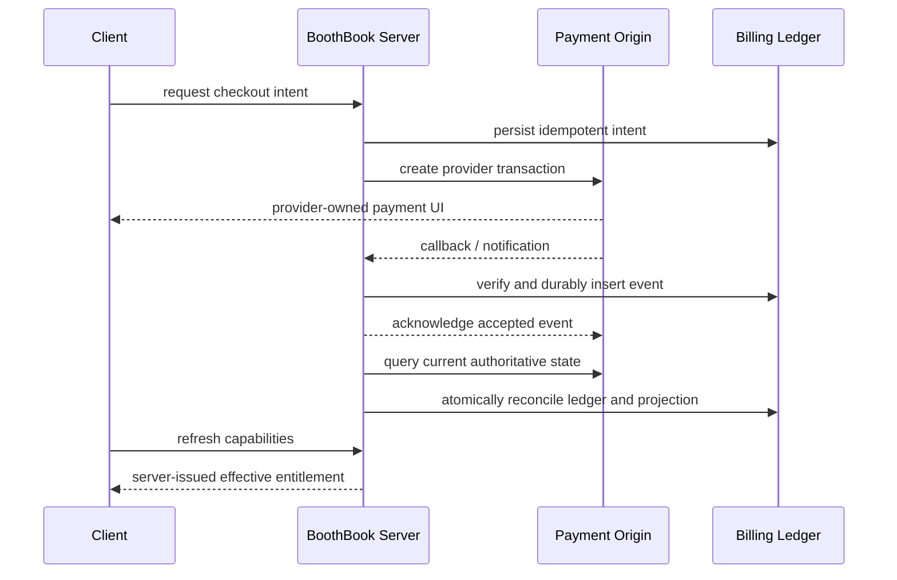
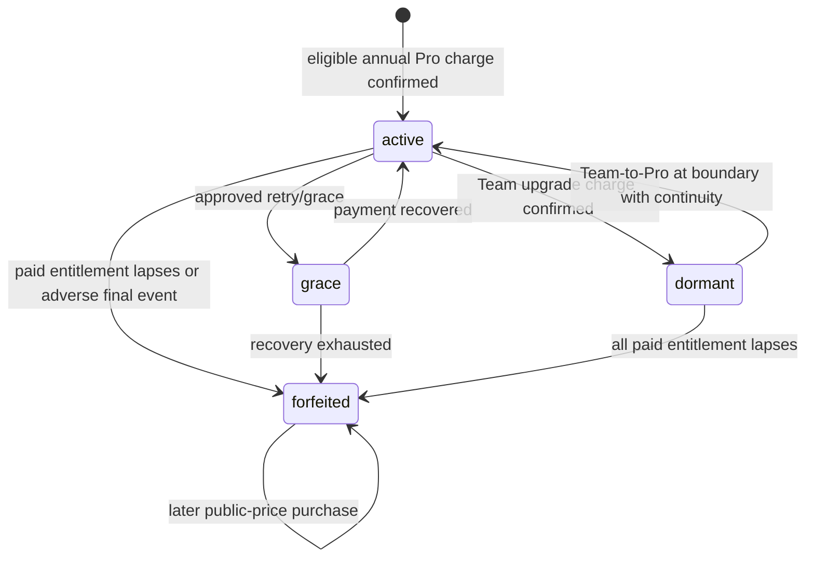

# Billing Lifecycle State Machine

日期：2026-07-30

狀態：S8 planning-only complete

依賴：

```text
BILLING_PROVIDER_DECISION.md
BILLING_DATA_SECURITY_DESIGN.md
BILLING_PROVIDER_ADAPTER_CONTRACT.md
```

## 1. 目的與邊界

這份契約把 Web provider、Apple、Google 與未來 aggregator 的不同事件正規化為同一套 billing、entitlement 與 Founder lock 狀態。它只定義設計，不新增 schema、route、SDK 或付款流程。

三個狀態軸必須分開：

```ts
type BillingStatus =
  | 'none'
  | 'trialing'
  | 'active'
  | 'past_due'
  | 'cancel_at_period_end'
  | 'cancelled'
  | 'refunded'
  | 'disputed'
  | 'unknown';

type EntitlementStatus = 'active' | 'grace' | 'inactive' | 'unknown';

type PriceLockStatus = 'active' | 'grace' | 'dormant' | 'forfeited';
```

- `billingStatus` 描述交易生命週期。
- `entitlementStatus` 才決定 capability 是否可用。
- `priceLockStatus` 只描述 Founder assignment 的延續性。
- 任何一軸都不能由 client flag、付款返回 URL 或本地時間改寫。

## 2. Provider-neutral logical records

下列是 S9 前的 logical records，不是已核准的 physical tables：

| Record | 用途 | 重要不變條件 |
| --- | --- | --- |
| `billing_customer_links` | owner UUID 對應 provider customer / storefront account | email 不作主鍵；一個 origin 一筆 active link |
| `billing_subscriptions` | provider subscription snapshot | 保留 origin、external id、status、period、freshness |
| `billing_transactions` | charge、refund、credit、dispute 與 settlement | external transaction id 唯一；金額使用 minor unit integer |
| `billing_event_inbox` | durable callback / notification inbox | provider + event id 唯一；payload access 受限 |
| `subscription_price_versions` / `billing_storefront_price_mappings` | immutable internal catalog 與 storefront refs | candidate 不可交易；sandbox / production 分離 |
| `subscription_price_assignments` | price version、Founder fixed amount 與 continuity | append/audit；不得由現行 public price 重算 |
| `billing_plan_change_quotes` | exact quote 與 provider snapshot | immutable、expires、single-use、server-owned |
| `billing_reconciliation_runs` | 查詢 provider 並修正 projection 的證據 | 記錄原因、來源、before / after 與結果 |
| `billing_adjustment_obligations` | 保存未完成的 customer credit / refund liability | 不遺失 unused actual-paid value |
| `billing_support_actions` | audited manual recovery and migration actions | narrow actions、reason、approval、idempotency |
| `subscription_accounts` | materialized plan / entitlement projection | protected writes 的 server authorization source |

F3 logical schema、RLS、retention 與 raw payload security 已由
`BILLING_DATA_SECURITY_DESIGN.md` 定義；physical schema、migration、writer 與 payload
encryption implementation 仍需個別核准。

## 3. Origin 與權威規則

`billingOrigin` 候選：

```text
newebpay_web
ecpay_web
apple_app_store
google_play
revenuecat_aggregate
```

`manual_migration` 是 audited support action / reconciliation trigger，不是 payment
origin，也不能實作 `BillingProviderReconciliationAdapter`。

- 同一 workspace 同一時間最多一個 active paid transaction origin。
- `revenuecat_aggregate` 若採用，只是 Apple / Google 的聚合視圖，不可掩蓋原始 store transaction id。
- Provider event 只觸發 reconcile；provider query / signed store state 才是交易狀態依據。
- Supabase subscription projection 是 app capability 的 authority；它只能由經驗證的 server reconciliation 更新。
- `admin` 與 `promotion` entitlement 可獨立存在，但不能製造或恢復 billing price lock。

發現雙重 active origin 時：

1. 不自動取消任何一方。
2. 不重複增加 capability。
3. 保留最新已驗證 paid entitlement，凍結 checkout 與方案異動。
4. 建立 support reconciliation case，確認退款或 migration。

## 4. Normalized transition matrix

| 目前狀態 | 已驗證事件 / reconciliation | 新 billing | 新 entitlement | 說明 |
| --- | --- | --- | --- | --- |
| none | eligible trial starts | trialing | active | 使用 trusted server timestamps |
| none / trialing | first charge settles | active | active | 指派 immutable price version |
| active | cancel scheduled | cancel_at_period_end | active | access 與 lock 保留至 paid end |
| cancel_at_period_end | cancellation revoked before lapse | active | active | 原 assignment 延續 |
| active / cancel_at_period_end | renewal succeeds | active | active | 更新 period，不能重建 Founder 金額 |
| active | renewal fails but approved grace applies | past_due | grace | grace 期限來自 provider / server config |
| past_due | retry succeeds | active | active | lock 從 grace 回 active |
| past_due | recovery exhausted and paid entitlement lapses | cancelled | inactive | Founder lock forfeited |
| active / cancel_at_period_end | paid period reaches verified end | cancelled | inactive | 不使用 client clock 單獨降權 |
| active | full refund approved and access revoked | refunded | inactive | Founder lock forfeited |
| active | partial refund | active | active | 不自動 forfeited；記錄 transaction |
| any paid state | dispute / chargeback opens | disputed | unknown or grace | 依核准風險政策 fail closed for paid writes |
| disputed | dispute won and provider confirms paid | active | active | 可恢復同一 assignment |
| disputed | dispute lost / charge reversed | disputed | inactive | Founder lock forfeited |
| any | provider state cannot be verified | unknown | unknown | protected paid writes fail closed；顯示恢復動作 |

`cancelled` 是已發生的狀態；排程取消使用 `cancel_at_period_end`。UI 不得在排程時提前顯示「已失去方案」。

## 5. Purchase 與 callback flow



處理規則：

1. 依最新 provider 文件驗證 checksum、signature、certificate、timestamp、environment 與 merchant identity。
2. 驗證前不解析成可信商業事件；驗證失敗留下最小安全稽核紀錄並拒絕。
3. 以 provider + event / transaction id 做唯一鍵；重送只重跑安全 reconcile，不重複 charge、refund 或 grant。
4. Durable inbox 成功後盡快回 provider 期待的 acknowledgment，耗時查詢由 reconciliation worker 處理。
5. Reconcile 主動查 provider current snapshot，不依 callback 到達順序推導最終狀態。
6. 比較 provider effective time、transaction sequence 與本地 last reconciled marker；舊事件不得覆寫新狀態。
7. Ledger、price assignment、subscription projection 與 audit record 要在同一 server transaction 或可恢復 saga 中提交。
8. Unknown、timeout 或 provider outage 不可被解讀為付款成功。

RevenueCat 若在未來採用，需額外驗證 raw body HMAC、timestamp tolerance、authorization header、duplicate event id 與 at-least-once delivery；收到 event 後仍要取得最新 subscriber snapshot 再 reconcile。

## 6. Reconciliation triggers

Reconciliation 至少由以下情境觸發：

- provider callback / store server notification；
- checkout return 後的 server refresh；
- app foreground / sign-in 時 capability freshness 過期；
- 每日 scheduled sweep；
- past_due / grace 的短週期 retry sweep；
- support 人員以 reason code 執行的單帳號 reconcile；
- price change、plan change、refund、dispute、owner identity anomaly；
- deployment 後的 canary verification。

禁止：client 任意指定 provider subscription id 要求 refresh、未授權 staff reconcile、以 local subscription simulator 寫入 reconciliation 結果。

## 7. Founder lock state machine



不變條件：

- `active` / `grace` renewal 永遠使用 stored assigned amount。
- `dormant` 不替 Team 打折，也不產生 Pro entitlement。
- 只有連續付費 Team 才能維持 dormant。
- `cancel_at_period_end` 本身不 forfeited；effective lapse 才 forfeited。
- 完成 forfeiture 後不可由取消反悔、client retry 或新 checkout 恢復舊價。
- full refund、chargeback、dispute 與 abuse 的最終結果必須有 reason code 與 actor / provider evidence。

## 8. Plan change quote contract

```ts
type PlanChangeQuoteMode =
  | 'provider_quote'
  | 'server_signed_quote'
  | 'provider_confirmation'
  | 'support_required';

type PlanChangeQuote = {
  quoteId: string;
  mode: PlanChangeQuoteMode;
  billingOrigin: string;
  fromPriceAssignmentId: string;
  toPriceVersionId: string;
  providerSnapshotRef: string | null;
  actualPaidAmount: number | null;
  unusedValue: number | null;
  chargeAmount: number | null;
  refundOrCreditAmount: number | null;
  currency: 'TWD' | string;
  effectiveAt: string | null;
  nextRenewalAt: string | null;
  expiresAt: string | null;
};
```

- 金額都是 currency minor units；不得使用浮點數。
- `server_signed_quote` 的 input 必須來自 provider-confirmed transaction snapshot。
- Proration 使用 UTC、明確的 inclusive / exclusive boundary 與已核准 rounding rule。
- Quote 在 price、period、provider snapshot、subscription status 或時間過期後失效。
- Quote 單次使用；replay 回傳原結果或明確 conflict，不再次執行金流。
- 無法確定的欄位維持 `null`。Client 不得補算。
- `support_required` 不顯示確認付款按鈕。

## 9. Pro -> Team saga

1. Owner-only server request，重新驗證 current capability、role 與 billing origin。
2. Query provider，產生 exact quote 或切換為 `support_required`。
3. Owner 接受未過期 quote；server 以 quote id 建立 single-use plan-change intent。
4. Provider 確認 Team charge / replacement transaction。
5. Atomically or recoverably：Team entitlement active、Team price assignment active、Founder Pro lock dormant。
6. 執行 unused Pro credit / refund，並記錄 provider transaction。
7. 修改或重建未來 Team recurring instruction。
8. Reconcile 最終 charge、credit / refund、effective time 與 next renewal date。

Saga failure：

- Team charge 失敗：保留原 Pro 與 Founder active，不做 credit / refund。
- Team charge 成功、projection 更新失敗：reconcile 必須依 provider transaction 補授予 Team，不可重扣。
- Team charge 成功、credit / refund 失敗：記錄 customer liability 與人工告警；不可丟失 unused value 或再次盲目退款。
- Callback 重送 / out of order：只 reconcile，不重執行 money movement。

## 10. Team -> Pro 與 cancellation

- Downgrade request 只建立 renewal-boundary schedule，不立即降權或退款。
- 每次 refresh 都以 provider verified boundary 為準；client clock 不切換方案。
- Boundary transaction 成功後，Team -> Pro；有 valid dormant lock 時恢復 Founder amount，否則用排程時核准的 Pro price assignment。
- Boundary transaction 失敗則進 provider retry / grace；不因一次 callback 直接 forfeited。
- 取消所有 paid service 時，Team 保留到 paid end；lapse 後 projection inactive，dormant lock forfeited。

## 11. Freshness、離線與 fail-closed

- Read-only 歷史資料可使用最近一次可信 cache。
- 付費 protected writes 需要 server-issued capability lease 未過期，且 server mutation 仍要重驗。
- Team 的離線 market-day write lease 長度尚未核准；在上架前必須定案並測試 clock skew、background、offline 與撤權。
- `unknown` 不等於 Free，也不等於 active。UI 顯示「無法確認訂閱」與重試 / 聯絡支援；server paid writes fail closed。
- 恢復服務後 reconcile，禁止使用 cache 把較新的 server state 回滾。

## 12. Retention 與隱私

- Raw provider payload 僅供受限稽核與 reconciliation，保存期限需經法務 / 會計 / 隱私審查。
- 不保存完整卡號、CVC 或 provider-owned payment fields。
- Log 必須遮蔽 token、signature、personal data 與 checkout secret。
- Support 操作必須有 actor、reason、before / after 與 provider evidence。
- 刪除帳號不能先於法定交易、退款、稅務與爭議保存期破壞帳務證據。
